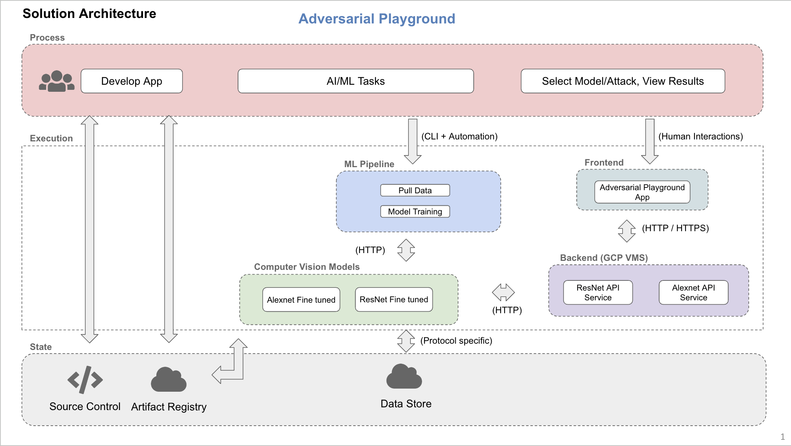
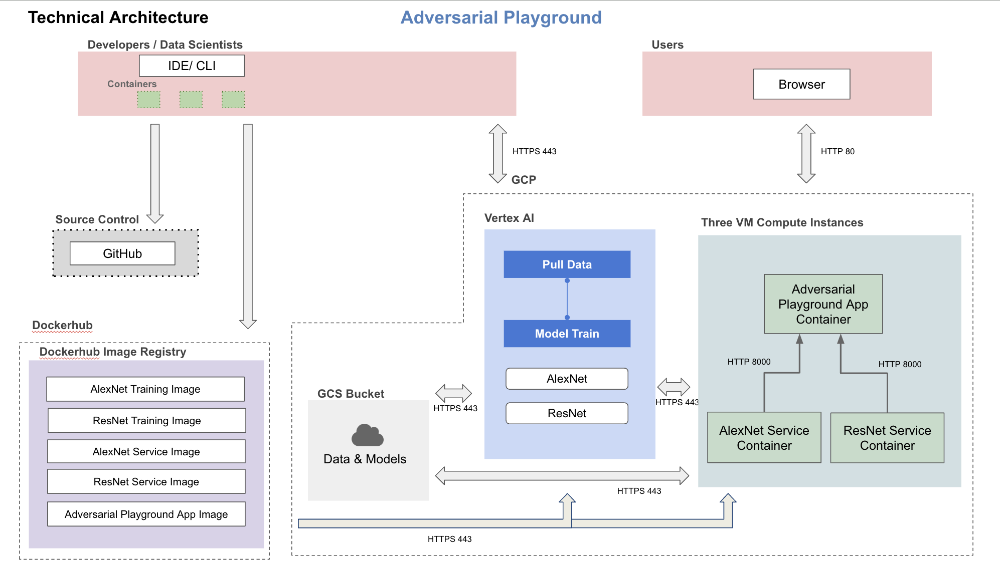
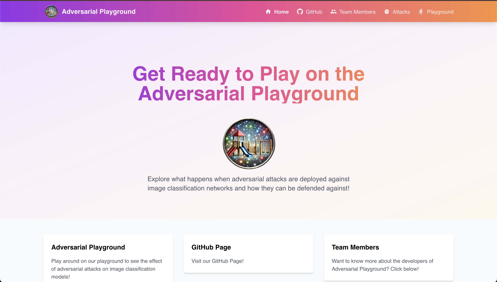

## Adversarial Playground Milestone 4

#### Project Milestone 4 Organization

```
.
├── LICENSE
├── README.md
├── deliverables
│   ├── application_mock_up.pdf
│   ├── presentation
│   │   └── Milestone 3 Presentation.pptx
│   ├── running_containers_envs
│   │   ├── art_container_env.PNG
│   │   ├── data_download_resnet_container_env.PNG
│   │   ├── data_download_yolo_container_env.PNG
│   │   ├── data_versioning_resnet_container_env.PNG
│   │   ├── data_versioning_yolo_container_env.PNG
│   │   ├── resnet_container_env.PNG
│   │   └── yolo_container_env.PNG
│   ├── solution_arch.pdf 
│   └── technical_arch.pdf
├── pytest.ini
├── src
│   ├── GTSRB
│   │   ├── Dockerfile
│   │   ├── docker-shell.sh
│   │   ├── python_files
│   │   └── requirements.txt
│   ├── app-building
│   │   ├── README.md
│   │   ├── frontend
│   │   └── images
│   ├── art_attacks
│   │   ├── README.md
│   │   ├── __init__.py
│   │   ├── alexnet_attacks
│   │   └── resnet_attacks
│   ├── data_download_resnet
│   │   ├── Dockerfile
│   │   ├── data_download_resnet.py
│   │   ├── docker-shell.sh
│   │   └── requirements.txt
│   ├── data_download_yolo
│   │   ├── Dockerfile
│   │   ├── data_download_yolo.py
│   │   ├── docker-shell.sh
│   │   └── requirements.txt
│   ├── data_versioning_resnet
│   │   ├── Dockerfile
│   │   ├── Pipfile
│   │   ├── Pipfile.lock
│   │   ├── docker-entrypoint.sh
│   │   ├── docker-shell.sh
│   │   └── resnet_dataset.dvc
│   ├── data_versioning_yolo
│   │   ├── Dockerfile
│   │   ├── Pipfile
│   │   ├── Pipfile.lock
│   │   ├── docker-entrypoint.sh
│   │   ├── docker-shell.sh
│   │   └── yolo_dataset.dvc
│   ├── docker-compose.yml
│   ├── requirements.txt
│   ├── resnet
│   │   ├── Dockerfile
│   │   ├── docker-shell.sh
│   │   ├── python_files
│   │   └── requirements.txt
│   ├── resnet_cloud
│   │   ├── Dockerfile
│   │   ├── Pipfile
│   │   ├── cli.py
│   │   ├── cli.sh
│   │   ├── docker-entrypoint.sh
│   │   ├── docker-shell.sh
│   │   ├── package
│   │   ├── package-resnet.sh
│   │   ├── python_files.tar.gz
│   │   └── requirements.txt
│   ├── workflow
│   │   ├── Dockerfile
│   │   ├── Pipfile
│   │   ├── Pipfile.lock
│   │   ├── cli.py
│   │   ├── docker-entrypoint.sh
│   │   ├── docker-shell.sh
│   │   ├── model.py
│   │   ├── model_deploy.yaml
│   │   ├── model_training.yaml
│   │   └── pipeline.yaml
│   ├── yolo
│   │   ├── Dockerfile
│   │   ├── docker-shell.sh
│   │   ├── python_files
│   │   └── requirements.txt
│   └── yolo_cloud
│       ├── Dockerfile
│       ├── Pipfile
│       ├── cli.py
│       ├── cli.sh
│       ├── docker-entrypoint.sh
│       ├── docker-shell.sh
│       ├── package
│       ├── package-yolo.sh
│       ├── python_files.tar.gz
│       └── requirements.txt
└── tests
    ├── test_alexnet_attacks.py
    └── test_resnet_attacks.py
```

# AC215 - Milestone4 - Adversarial Playground


**Team Members**
Jacob Huckelberry, Elijah Dabkowski, Edward Tang

**Group Name**
Black Knights

**Project:**
In this project, we aim to develop a framework to investigate the effects of adversarial attacks on image classification models. The app will feature two image classification networks trained to make medical diagnoses and classify street signs--both critical functionalities with large consequences in instances of failure. The user will then be able to use the Adversarial Robustness Toolbox to perform preset attacks against these models to demonstrate their efficacy. Additionally, there will be an option to create mitigations against attacks and evaluate the resulting effects.

----

### Milestone4 ###

In this milestone, we have the components for our Adversarial Playground frontend, model attack API services, and other components from previous milestones including versioning and model training.

The primary advances in this milestone are the implementiation of our Adversarial Playground front end using React and the implementation of our model attack api services using FastAPI. The code for our front end can be found in `/src/app-building` and the code for our api services can be found in `/src/art_attacks`. In addition, we have implemented GitHub actions to automatically run our tests found in `/tests` and linting.

**Application Design**
The highest level description of our application can be found in our solution architecture image below. A lower level description of our application can be found in the technical architecture image below.

Here is our Solution Architecture:



In this image, we can see that we developed each piece of our app in a local environment, pushing code changes to GitHub and docker images to Dockerhub along the way. For our AI / ML tasks, we have code that allows us to train our computer vision models in Vertex AI which are later used to launch attacks on. Our backend consists of two VMs. One serves attacks on our sign classification model, AlexNet, and the other serves attacks on our cancer classification model, ResNet. The results of these attacks are then displayed on our Adversarial Playground front end. The user is able to interact with the front end by choosing the model they want to attack and the attack they want to launch.

Here is our Technical Architecture:



This image gives a lower-level description of the workflow described above for our solution architecture. We push our code to GitHub and our Docker images to DockerHub. We are able to train models in Vertex AI that are then used in the Docker images we pull on our back end attack api VMs. The model attack api containers serve results to the Adversarial Playground front end container. The user interacts with the front end by selecting the model and attack they want to launch.

**Backend API**

We built backend api services using fast API to expose model attack functionality to the frontend for each model, Alexnet and Resnet. These apis take the model and attack, run an attack script, and return the results and a before and after image to the front end.

**Frontend**

A user friendly React app was built to allow users to launch adversarial example attacks on our back end computer vision models. Two drop down menus are currently exposed to the user that allow them to pick the model they want to attack and the attack they want to launch.

Here are some screenshots of our app:




## Running Dockerfile
Containers are run universally with `docker-shell.sh` scripts. To build, change the `BUILD` variable to `True`.

## Notebooks/Reports

**`deliverables/`**
   Contains screenshots for running containers, application mockup, milestone 3 presentation, both pdfs and pngs for our solution and technical architectures, and screen shots of our current app.

## TODOs

Before the showcase and final milestone due date, we have a few more features to implement.

- CD and automation: We plan to implement continuous deployment and automation for our app prior to the next deadline. We plan to make use of GitHub actions, ansible playbooks, and Kubernetes.
- Robust models: We plan to give the user the option to run attacks on adversarially robust models.
- User models: We plan to allow users to upload their own models and data to run attacks with.


## Model Weights Link

You can find the weights we use for our ResNet and Alexnet models here as well as our Resnet data.:

https://drive.google.com/drive/folders/12xqjhiSnE9g7RWqrwCIj-7xWYUFt366e?usp=drive_link


## Testing Documentation:

The testing strategy involves unit tests and integration tests that are used to validate the function of the python scripts that run the attacks for the adversarial robustness toolbox. 

The two files that are being tested are `alexnet_attacks.py` and `resnet_attacks.py`. These two files have the associated pytest files `test_alexnet_attacks.py` and `test_resnet_attacks.py`.

Both the attack files have a similar pipeline of loading a model and data, parsing arguments that select attack parameters, then running the attack.

The unit tests are run on each of these functions, with the integration test evaluating the performance of the entire pipeline.

Currently the tests are automatically run on pushes to development branches through Github actions.

### Testing Tools:

- pytest
- pytest-cov
- Hadolint
- Flint8
- Github actions

### Manual Test Usage:

To run all tests, in the repo root directory run:

```py
pytest
```

Tor run all tests with coverage report:

```py
pytest --cov
```

To generate an html coverage report:

```py
pytest --cov --cov-report=html
```


## Sources:

1. https://www.kaggle.com/datasets/valentynsichkar/traffic-signs-dataset-in-yolo-format
2. https://huggingface.co/datasets/marmal88/skin_cancer 
