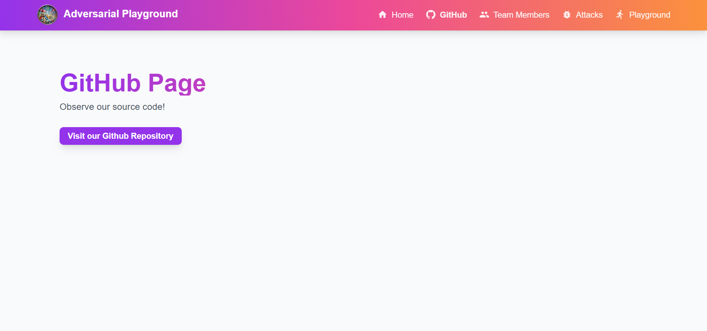
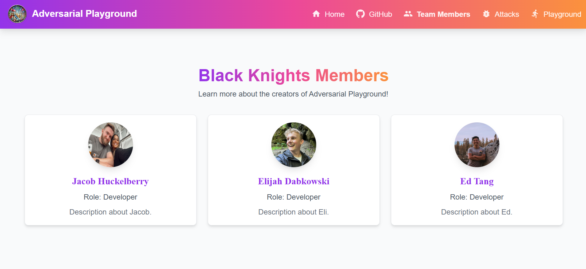
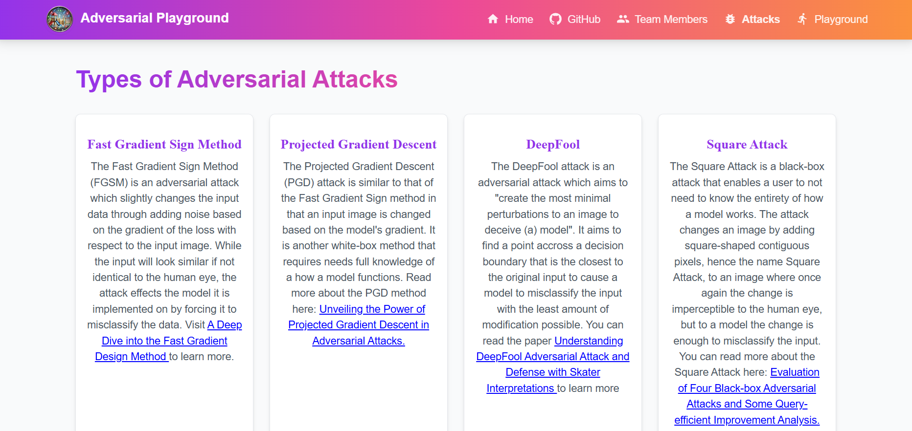
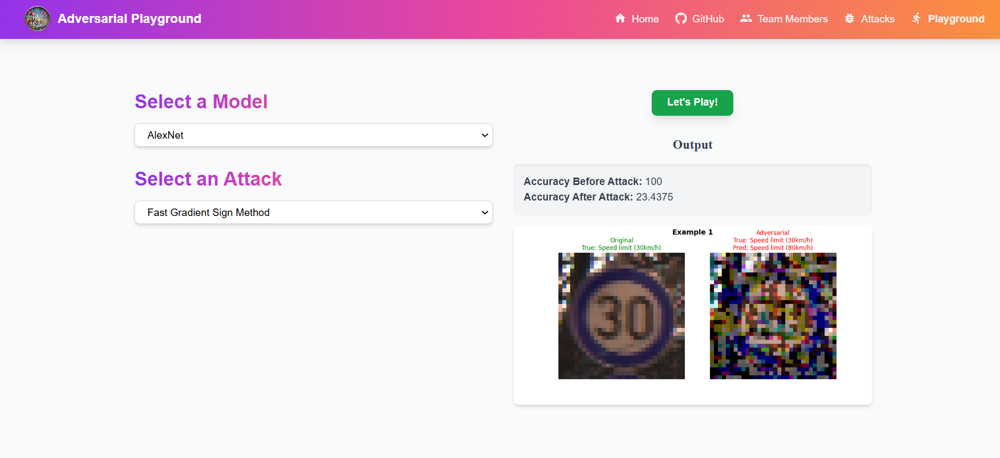

# Adversarial Playground App - Black Knights
 


In this README we will review how to interact with the frontend through the VM IP and the overall code structure that builds the frontend of the Adversarial Playground App

## Prerequisites
* Be able to access the internet through a browser
* Have Docker installed
* Have some form of IDE 

## Interacting w/ the Adversarial Playground App (Setup Instructions)
* If you would like to run our solution:
    * Navigate to http://34.16.0.151:3000
    * Play around on our virtual playground app!
* If you would like to create your own app or modify our functionality:
    * Begin by cloning this repository
    * Navigate your way through the files until you reach app-building/frontend
    * Modify  docker-shell.sh to contain whatever image name you want along with ensuring that the Dockerfile.dev file is the docker file being built.
    * Run ```sh docker-shell.sh``` to build and enter into the container
    * Run ```npm install```
    * Run ```npm run dev``` on your own machine and navigate your way to http://localhost:3000 to see the webpage.
    * You can now make changes and edit our implementation if you so wish.
    * Run the following commands in order to update your package.json file while the container is still active
        * ```npm install```
        * ```npm run build```
        * ```npm ci```
    * Exit the container and adjust the docker-shell.sh script to contain a new image name while changing Dockerfile.dev to Dockerfile
    * Running this should automatically boot up the frontend of the app, allowing you type http://localhost:3000 into your browser to view the frontend.
    * If you would like, you can proceed with pushing this image to dockerhub and then creating a VM instance on GCP to pull the image and run the frontend on a virtual machine.

## Usage Guidelines
After finding your way to http://34.16.0.151:3000, you will find yourself on the apps landing page.


You can use either the four header links at the top of the landing page or the four tabs at the bottom of the landing page to access other sections within our app. To start off, try navigating to our Github tab, you will be taken to a page which enables the interactor to navigate to our github repository.



Navigating to the Team Members tab, you will be able to learn more about the background and future of each of the three members of the Black Knighs.



If you are unfamiliar with the world of adversarial attacks, check out the Attacks tab to learn about the four attacks implemented with helpful links to provide more information on how these attacks work.



Finally, play around on our adversarial playground where you will be able to select both a model and type of attack you would like to use in order to see what the test accuracy of the selected model would be both before and after an attack has taken place.



## Application Components 

### General Code Tree (app-building directory)
```
.
├── README.md
├── frontend
│   ├── Dockerfile
│   ├── Dockerfile.dev
│   ├── docker-shell.sh
│   ├── jsconfig.json
│   ├── next.config.js
│   ├── node_modules
│   ├── package-lock.json
│   ├── package.json
│   ├── postcss.config.js
│   ├── public
│   │   └── assets
│   ├── src
│   │   ├── app
│   │   └── components
│   └── tailwind.config.js
└── images
    ├── advplayground.png
    ├── black_knight_2.png
    ├── playground-01.png
    ├── playground-02.png
    ├── playground-03.png
    ├── playground-04.png
    ├── playground-05.png
    └── playground-06.png
```

### General Code Overview
* Within the main app-building directory is the README.md file, an images directory, and a frontend directory. The images directory contains the images that are shown within the README.md file while the frontend directory contains the code that is utilized to build the react app. Within frontend directory lies the node_modules directory containing the installed packages, the src directory containing the react source code, and a multitude of other files which handle app operations. Additionally, the public directory within the frontend directory contains the static images that are used within the app.

### React Source Code Tree (app-building/frontend/src directory)

```
.
├── app
│   ├── attacks
│   ├── github
│   ├── globals.css
│   ├── globals.neon.nights.css
│   ├── layout.jsx
│   ├── members
│   ├── not-found.jsx
│   ├── page.jsx
│   └── playground
└── components
    ├── layout
    └── playground
```

### React Source Code Overview
* Within the React source code directory lies two other directories, including /app and /components. The /app folder contains the react pages while the /components folder holders the react components. The react pages directory contains the home page file (page.jsx) along with the specific page directories and subsequent page files such as /playground/page.jsx which are used to build what the user sees and interacts with on the frontend of our app. The react components directory contains the layout directory which is used to create the header and footer that is populated on every page of our app along with the playground directory which contains four seperate files, all of which interact with the backend to send a request and recieve a response for a models performance before and after an adversarial attack takes place. The page.jsx files within the /app folder then collect the specific response from these component files to populate the frontend with the output from our models running on the backend. 